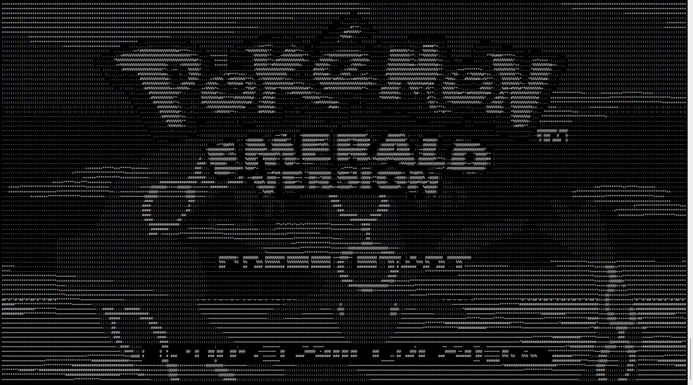

## ASCII Retro — A Minimalist Libretro Frontend in Your Terminal

**ASCII Retro** is a lightweight [Libretro](https://www.libretro.com/) frontend that renders classic games using ASCII characters directly in the terminal. It uses the [ncurses](https://invisible-island.net/ncurses/announce.html) library for UI rendering and supports **Linux**, **Windows** (via [MSYS2](https://www.msys2.org/), [Cygwin](https://cygwin.com/), and other Unix-like environments).

### Tested Games

This frontend has been tested with:

- [**Super Mario Bros.**](https://en.wikipedia.org/wiki/Super_Mario_Bros.) and [**Donkey Kong**](https://en.wikipedia.org/wiki/Donkey_Kong) on the [**NES** (Nintendo Entertainment System)](https://en.wikipedia.org/wiki/Nintendo_Entertainment_System)
- [**Pokémon Emerald**](https://en.wikipedia.org/wiki/Pokémon_Emerald) on the [**GBA** (Game Boy Advance)](https://en.wikipedia.org/wiki/Game_Boy_Advance)

### Emulator Cores

- **NES:** [fceumm_libretro](https://github.com/libretro/libretro-fceumm)
- **GBA:** [vba_next_libretro](https://docs.libretro.com/library/vba_next/)




# Getting Started

Follow these steps to build and run the ASCII Libretro frontend.

### Dependencies

Before building, make sure you have the following installed:

- **On Linux**

```bash
sudo yum install gcc
sudo yum install ncurses-devel
```

- **On Windows (MSYS2)**

```bash
pacman -Syu
pacman -S gcc ncurses-devel
```

### Build and run

Clone the repository and build using `make`:

```bash
git clone https://github.com/yimp/ascii-retro
cd ascii-retro
make -j`nproc`
```

This launches Pokémon Emerald using the `vba_next` core, with a save file and 30 FPS limit.

```bash
./ascii_frontend roms/pokemon.gba cores/vba_next_libretro.so saves/pokemon.sav 30
```

### Usage

```bash
Usage: ./ascii_frontend <rom_path> <core_path> [.sav path] [FPS]
```

| Argument      | Description                                                  |
| ------------- | ------------------------------------------------------------ |
| `<rom_path>`  | Path to the game ROM file (e.g., `roms/pokeemerald.gba)      |
| `<core_path>` | Path to the Libretro core `.so` / `.dll` file                |
| `[.sav path]` | *(Optional)* Path to the SRAM save file (e.g., `saves/pokeemerald.sav`) |
| `[FPS]`       | *(Optional)* Target frames per second (default is 120 if omitted) |

------

## Known Limitations & Controls

### Unimplemented Features

This project is a work in progress and currently has the following limitations:

1. **No Save Support Yet**
   - While SRAM save files (`.sav`) can be **loaded**, writing back changes is **not yet implemented**.
   - Save states (instant save/load) are **not supported** either.
2. **No Audio Output**
   - Audio is completely disabled. No music or sound effects will be heard during gameplay.
3. **Input Limitations**
    Due to limitations in terminal input handling (especially over SSH or with `ncurses`), the following restrictions apply:
   - **Key release events cannot be detected.**
   - **Key repeat** (holding a button) may conflict with emulated button **release behavior**.
   - **Multiple simultaneous keys** (e.g., diagonal directions or holding A+B) are not properly supported for repeats.

------

### Default Keyboard Controls

| Key        | Action                     |
| ---------- | -------------------------- |
| `Z`        | A button                   |
| `X`        | B button                   |
| `S`        | Select                     |
| `A`        | Start                      |
| `Q`        | L button                   |
| `W`        | R button                   |
| Arrow Keys | D-Pad (Up/Down/Left/Right) |

> These mappings are fixed in the current version. Future versions may include support for rebinding keys.

